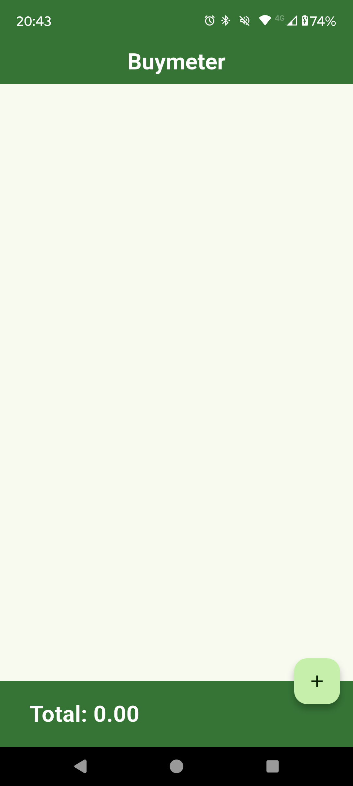

<h1>🛒BuyMeter📃</h1>
<h2>Build product lists and generate budgets.</h2>

A simple open source app built with flutter/dart.

The app takes a name, unit price and quantity (all provided by the user) and generates a card with said descriptions, alongside a total price for that item.

Each item card from the list can be individually edited and deleted by the user.

The app also provides a the list's total cost at the end.

Some features are still to be added, but it's main functionality is working without any known issues.

<h1>📱Screenshots📱</h1>

